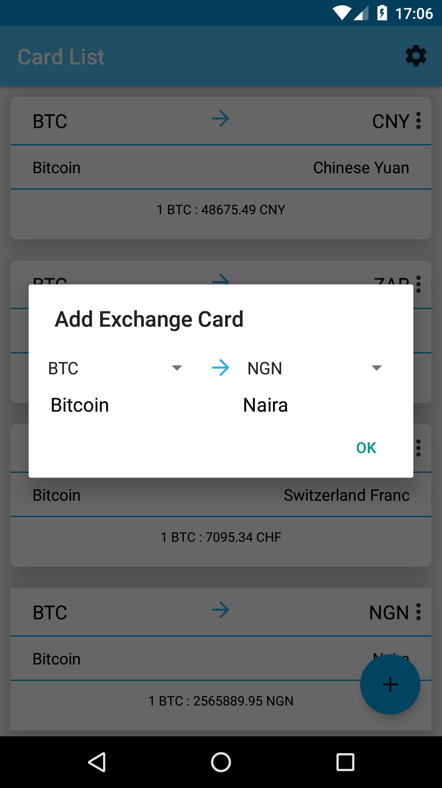
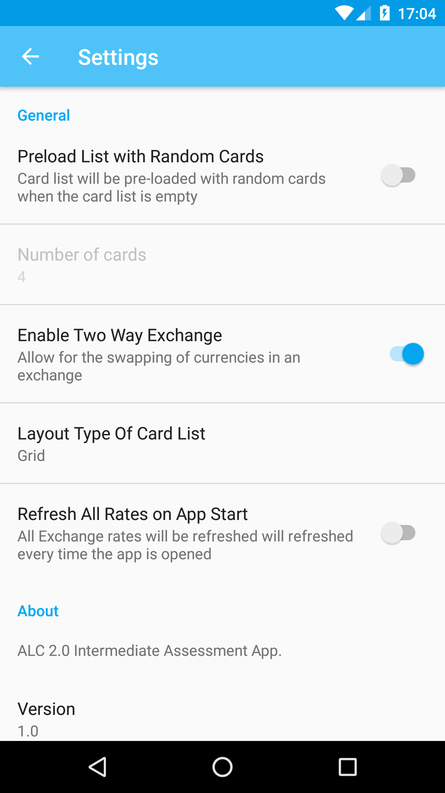
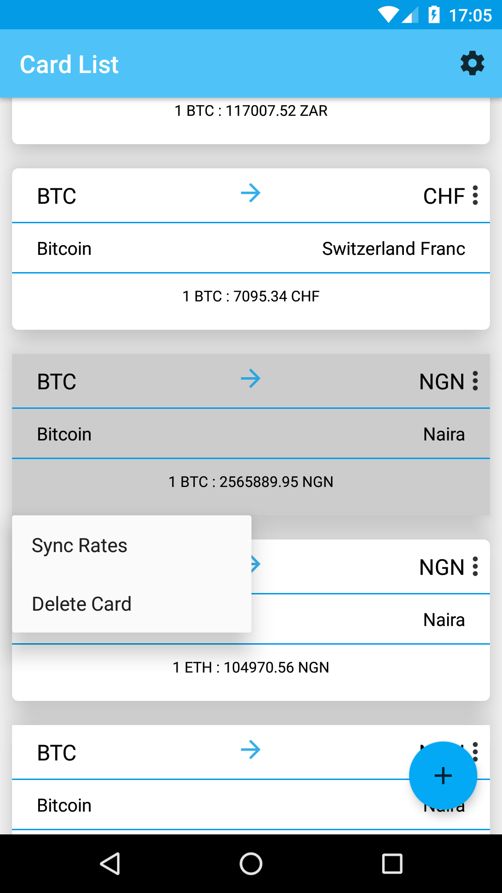
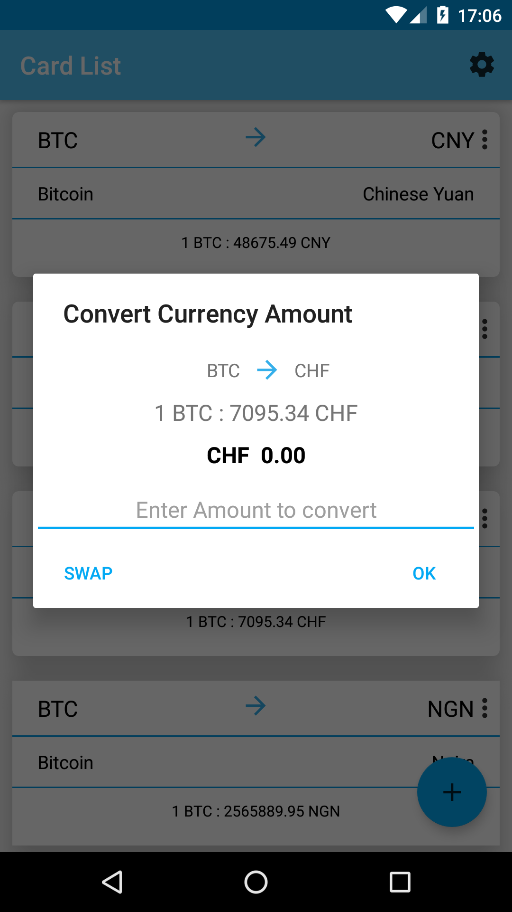
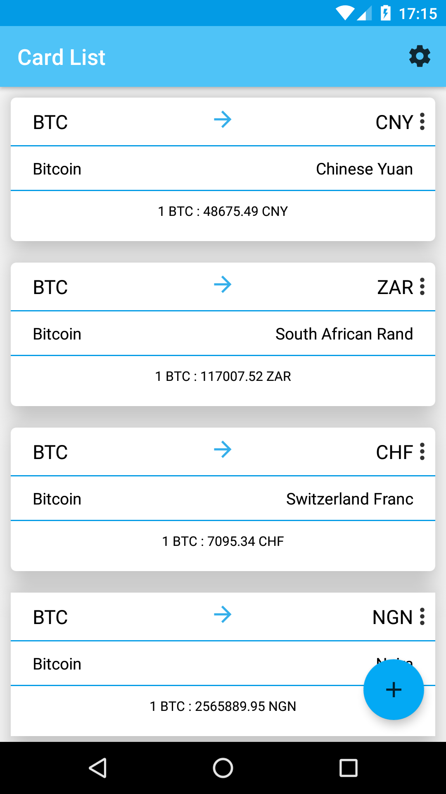
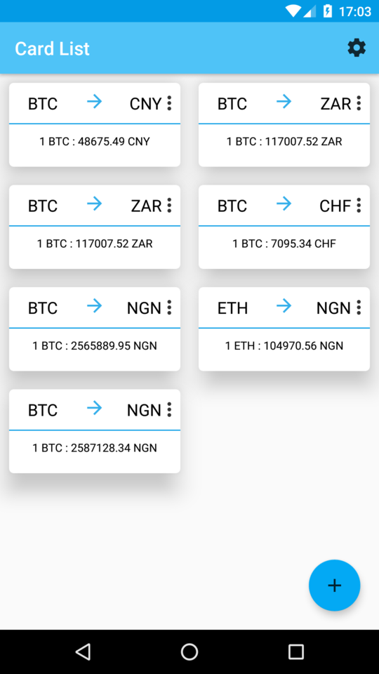

# ALC Assessment
ALC 2.0 Intermediate Assessment App Allowing users to keep up with
cryptocurrencies exchange rates.
# Screenshots

Creating Cards, Settings for preferences, Card settings

Currency Conversion, List View, Grid View

